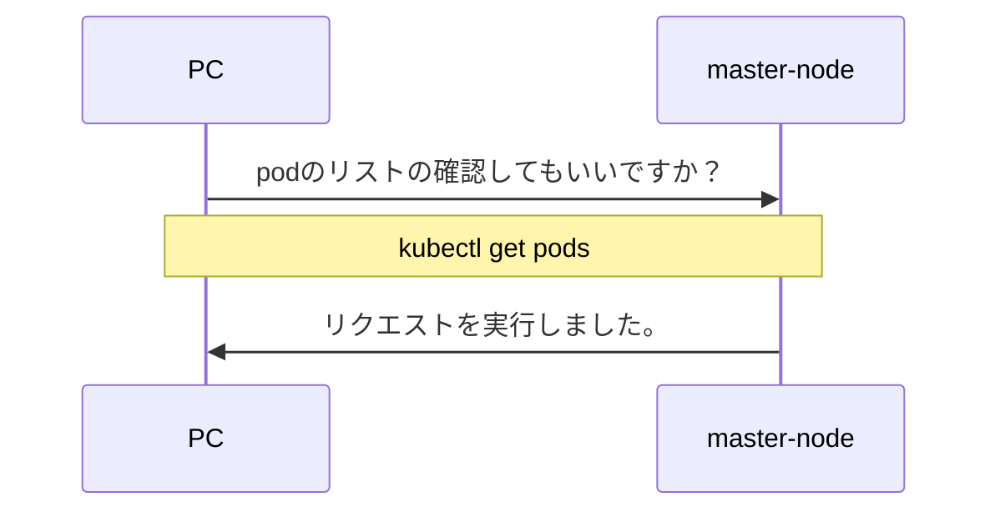
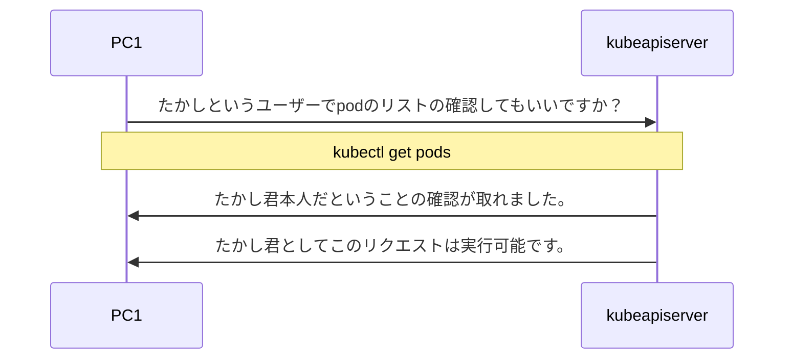
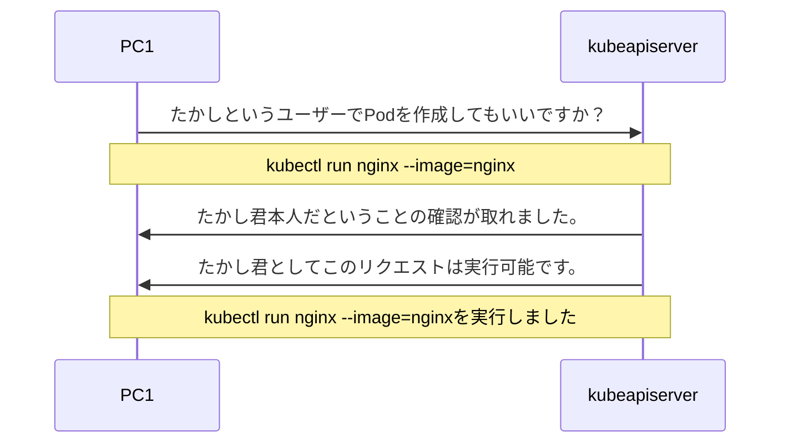
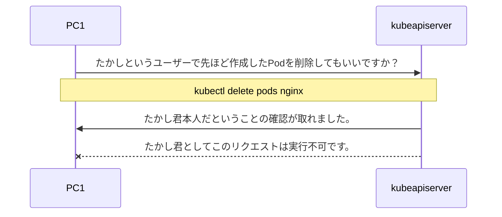
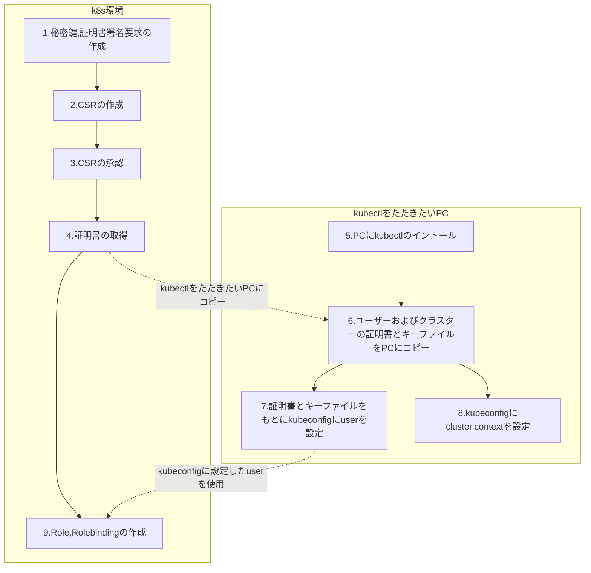

# kubectlたたきたい

自宅でオンプレのk8s環境の作成を行う場合、直接Linuxのターミナルか別PCからLinuxにSSH接続してkubectlをたたくと思います。これを別PCからSSH接続せずにコマンドプロンプトkubectlをたたくというのが今回の目的です。



# 環境

- master:1, worker:1のシンプルなk8s環境
- k8s version: v1.24.3
:::message
オンプレですでにk8s環境は構築済みでの話となります。
:::


# 使用される仕組み

- Certificate Signing Requests
- RBAC Authorization
- kubeconfig

以上の仕組みを少しだけ解説します。

---

### Certificate Signing Requests(CSR)/kubeconfig

公式サイトに以下のように説明されています。その下が和訳になります。

https://kubernetes.io/docs/reference/access-authn-authz/certificate-signing-requests/

> The Certificates API enables automation of X.509 credential provisioning by providing a programmatic interface for clients of the Kubernetes API to request and obtain X.509 certificates from a Certificate Authority (CA).
> A CertificateSigningRequest (CSR) resource is used to request that a certificate be signed by a denoted signer, after which the request may be approved or denied before finally being signed

> Certificates APIは、Kubernetes APIのクライアントが認証局（CA）にX.509証明書を要求して取得するためのプログラム的インターフェイスを提供することで、X.509クレデンシャル・プロビジョニングの自動化を可能にします。
> CertificateSigningRequest (CSR) リソースは、証明書が指定された署名者によって署名されることを要求するために使用され、その後、要求は最終的に署名される前に承認または拒否される可能性があります。

簡単に言うとkube-apiserverにアクセスする際に認証が必要ということになります。

例えば、PC1でたかし君というユーザーでkube-apiserverにリクエストを行った際に、まずは本当にたかし君なのかの認証を行い、たかし君だと確定できたら、次にこのリクエストを許可するかしないかの認可を行う形になります。



このなかでも「**認証**」機能を実装しているのがCertificateSigningRequest (CSR)とkubeconfigになります。実際に行う際に詳しく説明します。

### RBAC Authorization

https://kubernetes.io/docs/reference/access-authn-authz/rbac/

> Role-based access control (RBAC) is a method of regulating access to computer or network resources based on the roles of individual users within your organization.

> ロールベースアクセスコントロール（RBAC）とは、組織内の個々のユーザーの役割に基づいて、コンピューターやネットワークリソースへのアクセスを規制する手法のことである。

簡単に言うと、ユーザーに与えられる権利を規制することができる機能になります。


例えば、PC1でたかし君というユーザーはPodとDeploymentの作成のみ許可されているとします。そうするとPodを作成したいというリクエストを行うことができます。



一方で、先ほど作成したPodを削除したいというリクエストとなると許可されていません。


したがって、「**認可**」機能を実装しているのがRBACになります。実際に行う際に詳しく説明します。


以上の仕組みを使用し実装していきます。

# 実装したい目標

PC1を使用しているたかし君から以下のことを行いたいと要望がありました。

「PC1からDeploymentとServiceの管理したい」

とのことでした。というていでやっていきます。

今回はNamespaceに「takashi」を作成し、ここで以下のコマンドを打てるように実装します。これでたかしくんの要望は満たせると思います。

- Windows(PC1)から「takashi」というユーザーでk8s環境にnginx:1.16のDeploymentを作成
- Windows(PC1)から「takashi」というユーザーでk8s環境のDeploymentの一覧を確認
- Windows(PC1)から「takashi」というユーザーでk8s環境にService(NodePort)を作成し、Deploymentの公開
- Windows(PC1)から「takashi」というユーザーでk8s環境のServiceの一覧を確認
- Windows(PC1)からnginxのスタートページの閲覧
- Windows(PC1)から「takashi」というユーザーでk8s環境にある作成したDeploymentとServiceの削除

:::message
適当に決めたので、適宜行いたいロールに合わせて変更してください。
:::


# 実装の流れ



詳しい流れはこのリンクを参照下さい。
https://kubernetes.io/docs/reference/access-authn-authz/certificate-signing-requests/

::::details 1. 秘密鍵,証明書署名要求の作成

CSRはSSL認証を使用しています。詳しくはご自身での勉強をお願いします（調べればすぐ出てくると思います）。

- まずはk8s環境の入っているマスターノードにSSH接続か直接ターミナルの移動をお願いします。
```sh
ssh <Linuxユーザー名>@<プライベートIPアドレス>
```

:::message
Linux(k8s)の操作になります。
:::

- 秘密鍵を保存するディレクトリの作成
```sh
mkdir takashi
```

- ディレクトリの移動
```sh
cd takashi
```

- 秘密鍵の作成
```sh
openssl genrsa -out takashi.key 2048
```

- 証明書署名要求(CSR)の作成
```sh
openssl req -new -days 3650 -key takashi.key -out takashi.csr
```
:::message
色々聞かれますがCNにはtakashiと入力し、それ以外はEnterキーを押していれば大丈夫です。
:::

- 確認
```sh
ls
> takashi.csr  takashi.key
```
lsコマンドで以上の二つがあれば問題ありません。
::::

::::details 2. CSRの作成

:::message
Linux(k8s)の操作になります。
:::

- 先ほどと同じディレクトリに以下のようなyamlファイルを作成
```sh
vi takashi.yaml
```

```yaml:takashi.yaml
apiVersion: certificates.k8s.io/v1
kind: CertificateSigningRequest
metadata:
  name: takashi
spec:
  groups:
  - system:authenticated 
  request: 
  expirationSeconds: 8640000
  signerName: kubernetes.io/kube-apiserver-client
  usages:
  - client auth
  - digital signature
  - key encipherment
```

::: message alert
expirationSecondsは認証する期間になります。秒単位になります。
:::

- 作成したtakashi.csrのデコード
```sh
cat takashi.csr | base64 | tr -d "\n"
```
長い文字列がが表示されますがこれをコピーします。これを先ほど作成したyamlファイルのrequestの箇所にコピーします。

```diff yaml:takashi.yaml
apiVersion: certificates.k8s.io/v1
kind: CertificateSigningRequest
metadata:
  name: takashi
spec:
  groups:
  - system:authenticated
- request:
+ request: LS0tLS1CRUdJTiBDRVJUSUZJQ0FURSBSRVFVRVNULS0tLS0KTUlJQ2lqQ0NBWElDQVFBd1JURUxNQWtHQTFVRUJoTUNRVlV4RXpBUkJnTlZCQWdNQ2xOdmJXVXRVM1JoZEdVeApJVEFmQmdOVkJBb01HRWx1ZEdWeWJtVjBJRmRwWkdkcGRITWdVSFI1SUV4MFpEQ0NBU0l3RFFZSktvWklodmNOCkFRRUJCUUFEZ2dFUEFEQ0NBUW9DZ2dFQkFMNWRocXNGNmNyNUs3OWJobHVzS0Jwc25EcmF4YkhnNkJCY3AvWDQKSDUvc1k1T1dsVmJBdGxWeE13d0xZV3l3N3dxQXA5TjZyMXpLUkVwRXRYWnNkQU9DNGE2WUwxMlhSeW9RMkE2Ywp4UDhwMEhXVEt1S044TEhDNDJna3kwcDlpM2FhYXlTRkRNbnJrM0hPMngwN2ppZ0RDa2UwbnlXOFlESjYzcEJpClZZeVk0SHZFdGYvOTdVNEtLS21oU3hrZXNQMUlYOWxLazRpZFB6M2lQYjE2SmJBa21aLzdueXRRUVFnMzdpWlAKTGlqc1NzZ2Rha3U5cDArRVJGRVdTMmt4SlBJWFA5V0lHQVl0bzcxcEZkVndDWlp6M1NmcHZUVk5udTFLWTlvVwpXL1dlNm4xMUZKYm9uNGpIWW1Rc2gydEZ1cWhLVGs4VktEdkVaWGpUNUYvYmw3TUNBd0VBQWFBQU1BMEdDU3FHClNJYjNEUUVCQ3dVQUE0SUJBUUJveExaR3RsQ09OQzFrcTJJcXAxSElqWDJNKzZxVWcySkJkRERxdVlNcElXQmcKc1J2aDR1b0tHSkdVRkJyMUhveE02WDZVazk3cTk0eFE5dk42ZURnYk55R2dNQmdQRzdKdG5uNlpRYnpLbG9HbApkUFRhdnI1bzNFSW9uVjF4U0tlUFMyWnBNcW1Rc3NaczNUaU5HdTFxL09NOHNxWTIycElqWmphZ0hVOW9YYTlMCkExVi9JZzdlSGt2UkFXUHphM1pCVGdCcXA3TkEwNU8vczd5SkNseFg0enV5SjFwd0xBaHBKVFpwbXE4Sk92YVAKUWJoRksvUVREVDFMNUVZQkV3MVNnaGNBVFJKeXBlREdQSStHSmxuWUg4UjExQXJ4NXlvZVU3WEYvb0Nlam4yNgpCdnNxQkVCLzh2TDdiYWdWdTFGc2xUNFAyZis4UzBaSWhXSS9saU1CCi0tLS0tRU5EIENFUlRJRklDQVRFIFJFUVVFU1QtLS0tLQo=
  expirationSeconds: 86400
  signerName: kubernetes.io/kube-apiserver-client
  usages:
  - digital signature
  - key encipherment
  - client auth
```

- CSRのアプライ
```sh
kubectl apply -f takashi.yaml
> certificatesigningrequest.certificates.k8s.io/takashi created
```

::::

:::: details 3. CSRの承認

:::message
Linux(k8s)の操作になります。
:::

CSRの確認をしましょう。
```sh
kubectl get csr
```
以上のコマンドを打つとたかし君が追加されていると思います。しかしCONDITIONはPENDINGなのでまだ承認されていません。以下のコマンドを打ちます。

```sh
kubectl certificate approve takashi
```

再びCSRの確認を行うとたかし君のCONDITIONはApprovedになっていると思います。これで承認は完了です。

::::

:::: details 4. 証明書の取得

:::message
Linux(k8s)の操作になります。
:::

```sh
kubectl get csr takashi -o yaml
```
このコマンドによりtakashiのyamlファイルを見ることができます。

この中のstatus.certificateにある文字列が認証書のコードになります。

したがってjsonpathで抽出し、crtファイルで保存します。
```sh
kubectl get csr takashi -o jsonpath='{.status.certificate}'| base64 -d > takashi.crt
```

続いてクラスターの認証書をファイル保存します。

```sh
kubectl config view --minify --raw -o jsonpath='{.clusters[*].cluster.certificate-authority-data}' | base64 -d > ca-cluster.crt
```

確認を行います。

```sh
ls
> ca-cluster.crt takashi.crt  takashi.key takashi.csr  takashi.yaml
```
lsコマンドで以下の4つがあれば大丈夫です。
::::

:::: details 5. PCにkubectlのイントール

:::message
Linux(k8s)の操作になります。
:::

以下のリンクが参考になります。
https://kubernetes.io/docs/tasks/tools/install-kubectl-windows/#install-kubectl-binary-with-curl-on-windows

- SSH接続を切断

```sh
exit
```

:::message alert
Windows(kubectlをたたきたいPC)の操作になります。
:::

- 任意の場所にフォルダーを作成します
```sh
mkdir takashi
```
- フォルダ下に移動
```sh
cd takashi
```

- curlを用いてkubectlをインストール
```sh
curl -LO "https://dl.k8s.io/release/v1.24.3/bin/windows/amd64/kubectl.exe"
```

- ダウロードしたファイルを環境変数のPathに登録

以下が参考になります。

https://proengineer.internous.co.jp/content/columnfeature/5205

:::message
ダウンロードした先のフォルダーの絶対パスを指定します。いまはtakashiフォルダにインストールされていると思います。
:::

- kubectlの実行可能か確認
```sh
kubectl version --client
```
versionがv1.24.3と表示されれば大丈夫です。
::::

:::: details 6. ユーザーおよびクラスターの証明書とキーファイルをPCにコピー

:::message alert
引き続きWindows(kubectlをたたきたいPC)の操作になります。
:::

- keyファイルとcrtファイルをWindowsのtakashiフォルダーにコピー
```sh
scp <Linuxユーザー名>@<プライベートIPアドレス>:~/takashi/takashi.key ./
scp <Linuxユーザー名>@<プライベートIPアドレス>:~/takashi/takashi.crt ./
scp <Linuxユーザー名>@<プライベートIPアドレス>:~/takashi/ca-cluster.crt ./
```

- dirコマンドで確認

```sh
dir
```

kubectl.exeとtakashi.keyとtakashi.crtとca-cluster.crtファイルがあれば大丈夫です。

::::

:::: details 7. 証明書とキーファイルをもとにkubeconfigにuserを設定

:::message alert
引き続きWindows(kubectlをたたきたいPC)の操作になります。
:::

- userの登録

takashiとしてkubeconfigにuser登録します
```sh
kubectl config set-credentials takashi --client-key=takashi.key --client-certificate=takashi.crt --embed-certs=true
```

- 確認
```sh
kubectl config view
```

ここにたかし君が含まれていれば大丈夫です。

::::

:::: details 8. kubeconfigにcluster,contextを設定

:::message alert
引き続きWindows(kubectlをたたきたいPC)の操作になります。
:::

- kubeconfigにclusterの登録
```sh
kubectl config set-cluster takashi-cluster --server=https://<プライベートIPアドレス>:6443 --certificate-authority=ca-cluster.crt --embed-certs=true
```

- kubeconfigにcontextの登録
```sh
kubectl config set-context takashi@takashi-cluster --cluster=takashi-cluster --namespace=takashi --user=takashi
```

- kubeconfigにcurrent-contextの設定
```sh
kubectl config use-context takashi@takashi-cluster
```

- 確認
```sh
kubectl config view
```

ここに追加したclusterとcontextがあれば大丈夫です。
またcurrent-contextがtakashi@takashi-clusterとなっていれば問題ありません。

:::message alert
プライベートIPアドレスはマスターノードのIPアドレスになります。
:::

::::

:::: details 9. Role,Rolebindingの作成

:::message
Linux(k8s)の操作になります。
:::

今回の要件はNamespaceがtakashi下でのServiceとDeploymentの管理ということになります。

- Namespaceの作成
```sh
kubectl create ns takashi
```

- Roleの作成
```sh
kubectl create role takashi-role -n takashi --resource=deployment,service --verb=*
```

ServiceとDeploymentのコマンドをすべて許可します。

- Rolebindingの作成
```sh
kubectl create rolebinding takashi-rolebinding -n takashi --user=takashi --role=takashi-role
```

登録したtakashiとRoleを紐づけします。

- 確認

```sh
kubectl get ns
kubectl get role,rolebinding -n takashi
```

ここに作成したNamespace, Role, Rolebindingがあれば大丈夫です。

::::


ここまで行うと実際にkubectlの実行が可能になっていると思います。

# 検証

- Windows(PC1)から「takashi」というユーザーでk8s環境にnginx:1.16のDeploymentを作成

```sh
kubectl create deployment nginx --image=nginx:1.16 --replicas=3 
```

```sh
> deployment.apps/nginx created
```
- Windows(PC1)から「takashi」というユーザーでk8s環境のDeploymentの一覧を確認

```sh
kubectl get deployment
```

```sh
NAME    READY   UP-TO-DATE   AVAILABLE   AGE
nginx   3/3     3            3           61s
```

- Windows(PC1)から「takashi」というユーザーでk8s環境にService(NodePort)を作成し、Deploymentの公開

```sh
kubectl expose deployment nginx --port=80 --target-port=80 --name=nginx-service --type=NodePort
```

```sh
> service/nginx-service exposed
```

- Windows(PC1)から「takashi」というユーザーでk8s環境のServiceの一覧を確認
```sh
kubectl get service
```

```sh
NAME            TYPE       CLUSTER-IP       EXTERNAL-IP   PORT(S)        AGE
nginx-service   NodePort   10.110.146.250   <none>        80:31410/TCP   27s
```

- Windows(PC1)からnginxのスタートページの閲覧

http://<プライベートIPアドレス>:<NodePort>にアクセス

:::message
私の場合はNodePortは31410になります。作成のたびに異なります。
:::

「Welcome to nginx!」が見れれば成功

- Windows(PC1)から「takashi」というユーザーでk8s環境にある作成したDeploymentとServiceの削除
```sh
kubectl delete svc nginx-service
kubectl delete deployment nginx
```

```sh
> service "nginx-service" deleted
> deployment.apps "nginx" deleted
```

:::: details 追加課題

- Windows(PC1)から「takashi」というユーザーでk8s環境のPodの一覧を確認

```sh
kubectl get pods
```

```sh
Error from server (Forbidden): pods is forbidden: User "takashi" cannot list resource "pods" in API group "" in the namespace "takashi"
```

- Windows(PC1)から「takashi」というユーザーでk8s環境でPodの作成

```sh
kubectl run nginx --image=nginx
```

```sh
Error from server (Forbidden): pods is forbidden: User "takashi" cannot create resource "pods" in API group "" in the namespace "takashi"
```

Roleで認可されていないリクエストは実行できないことが分かります。

::::

以上からPC1からDeploymentとServiceの管理したいという要求は満たせています。

# まとめ

今回は別PCからSSH接続せずにkubectlをたたくということで以上のことを行いました。工程が多く初期設定の際には躓くことが多いかと思われます。またユーザーの認証期間が過ぎますとまた同じように1, 2, 3, 4, 6, 7の工程が必要になります。
