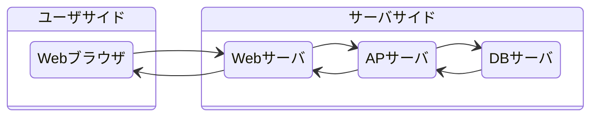
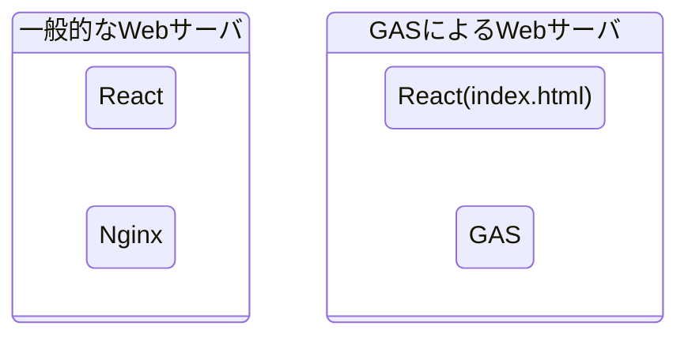
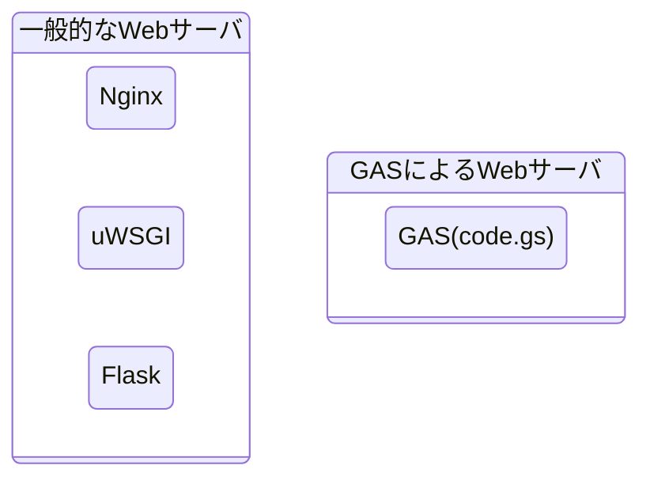
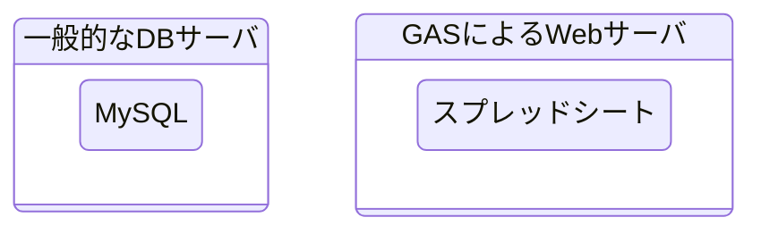

# GASにおけるWebアプリケーションの考え方

## 一般的なWebアプリケーションについて

一般的なWebアプリケーションは以下のようにWebサーバ、APサーバ、DBサーバーの三つのサーバを別々のノードに配置する構成になります。ユーザはWebブラウザからWebサーバにアクセスしWebアプリケーションを使用します。したがってユーザがWebアプリケーションを利用できるようにするためにはWebサーバ、APサーバ、DBサーバーの3つをGASで構築することになります。

## Webサーバ
Webサーバはユーザがアクセスに対してWebアプリケーションを提供する役割を担います。ユーザが直接触る場所になります。一般的にはReact、Vue、HTML/CSS/Javascriptといったフロントエンド系の言語で作成されます。Reactであれば、アプリケーションを作成、ビルドし、NginxでWebサーバを構築します。

GASの場合においてもReactでの作成が可能になります。同様にアプリケーションを作成、ビルドしGASでWebサーバを構築します。

:::message
役割としてはNginx⇔GASという関係になります。
:::

### ビルドツール「Vite」
GASでWebアプリケーションをデプロイする際、htmlファイルを指定しデプロイします。したがってReactで作成したアプリケーションをデプロイするために一つのhtmlファイルをまとめる必要があります。その際に使用するのものがViteになります。環境構築の際も説明しますが、Viteを用いて初期構築していきます。

:::message
React⇔.htmlという関係になります。
:::

詳しくは以下の公式サイトを閲覧ください。

@[card](https://ja.vitejs.dev/)

## APサーバ
APサーバはWebサーバからリクエストを受けて処理、必要に応じてDBサーバへの問い合わせや書き込み処理をし、処理結果をWebサーバへ提供する役割を担っています。基本的にユーザは見ることありません(API等あれば別です)。一般的にはJava、Go、Pythonといったバックエンド系の言語で作成されます。PythonでFlaskを使用する場合はFlask+uWSGI+Nginxで構築することになります。

GASの場合はGAS専用の拡張子`.gs`を用いて作成します。APサーバといったもので構築するのではなく、.gsファイル単体で作成することができます。

:::message
Webサーバ⇔GAS(.gs)という関係になります。
:::

## DBサーバ
DBサーバはデータを一元管理し、検索、更新、保存といった役割を担っています。 APサーバからのリクエストに対しデータの検索やデータの更新を行います。主に永続化したいデータの保存先になります。一般的にはOracleDB、MySQL、PostgreSQLといったRDBMSになります。OracleDBの場合は、シンプルにDBサーバを構築することになります。

GASの場合はGoogleのサービスの一つスプレッドシートになります。DBサーバといったもので構築するのではなく、スプレッドシートで作成することができます。

:::message
DBサーバ⇔スプレッドシートという関係になります。
:::

## それぞれのサーバの接続方法

一般的なWebアプリケーションはそれぞれのサーバでhttp通信で情報のやり取りを行っています。